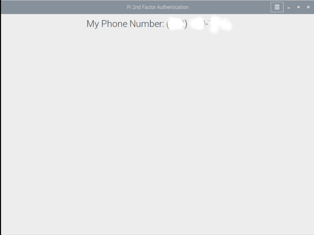
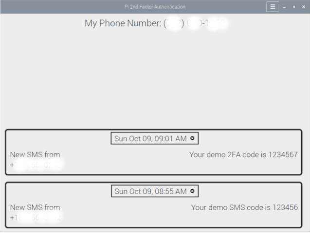

# Raspberry Pi 3B/3B+ 2FA

This MVP software provides a cheap, alternate second factor authentication (2FA) phone number on a Raspberry Pi 3B/3B+.  It solves the problem of companies requiring you to add a mobile phone number to your account and then using that phone number for targeting ads, leaking the phone number, etc. Companies keep doing this.  And I don’t see them stopping.

Hacker news discussion that inspired me:
https://news.ycombinator.com/item?id=32399949

## Demo
Below are a couple of screenshots.
1.  The software is running and the Pi is waiting for an SMS.   
  

2.  An SMS (or two) comes in and they are displayed is a scrolling list.

For this demo, the Pi3B is headless and I'm accessing it over VNC.  I also have it working on the official Raspberry Pi Touch Screen.

I built this for myself and I've been really happy with it.  I want to know if enough people are interested for me to commercialize it.

